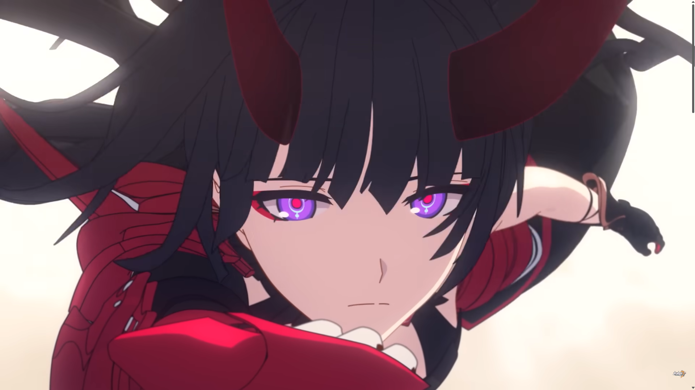
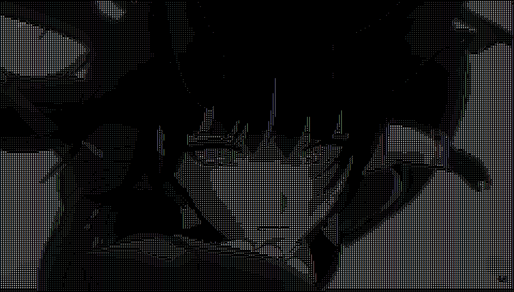
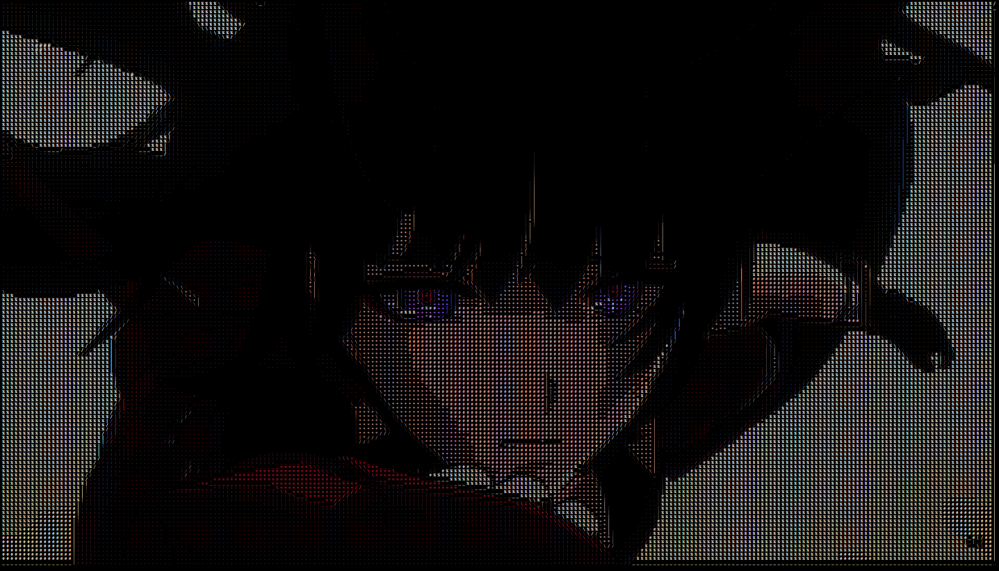
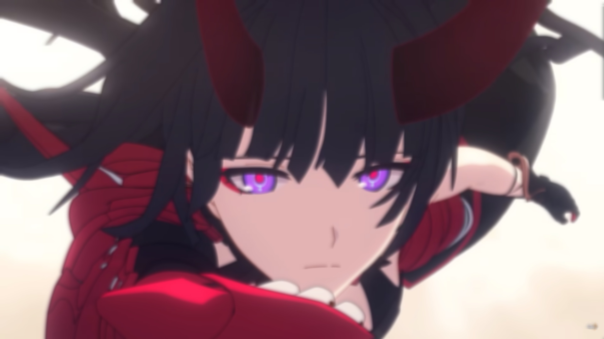
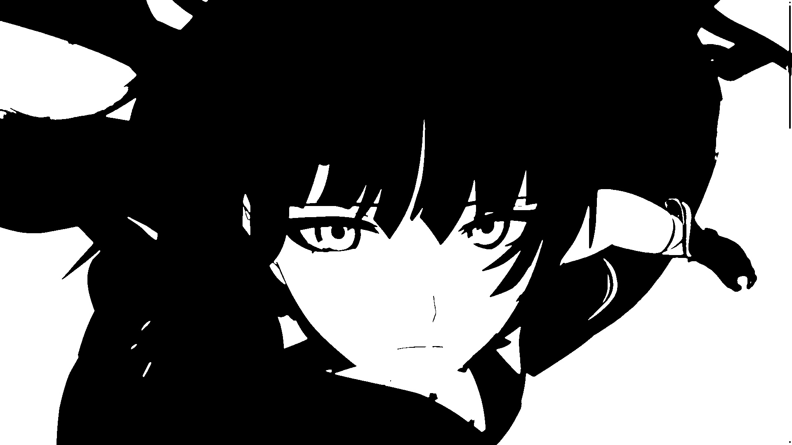
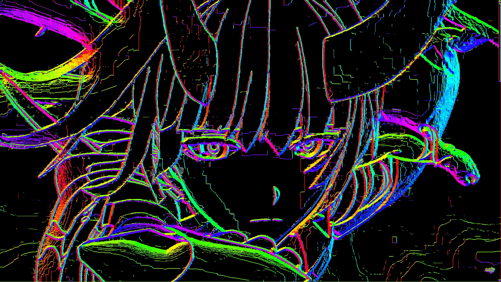
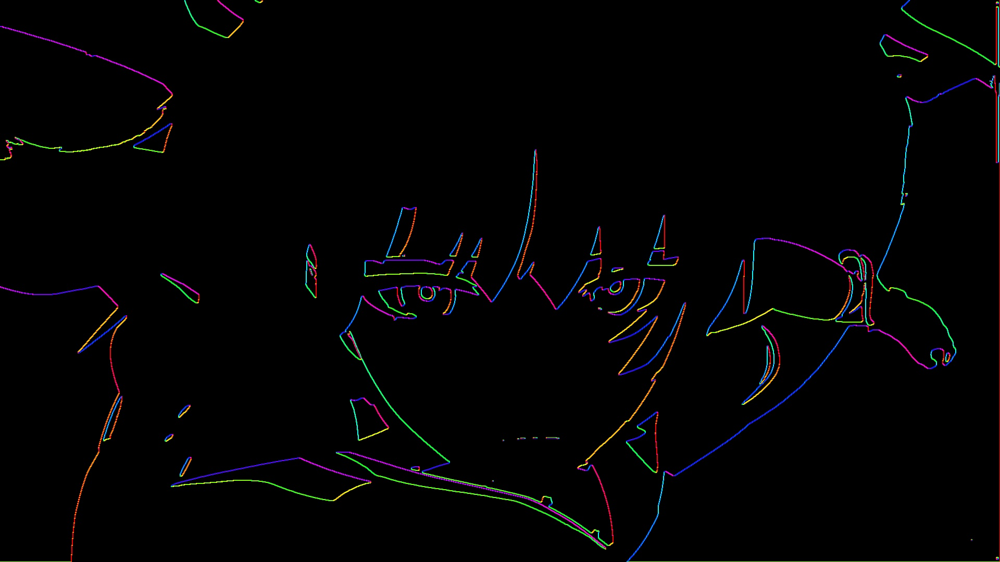

[На русском](README_ru.md)

# ImgToASCII
Program for converting images to ASCII.

This project is inspired by the video [I Tried Turning Games Into Text](https://www.youtube.com/watch?v=gg40RWiaHRY).

## Goal
To study algorithms for graphics processing.

## How it works
A series of filters are applied to the image, and then the result is output to an HTML file with the option to save colors. The filters are needed to preserve the boundaries of objects and output them as `_ / \ |` characters in ASCII.

Since the goal is to study algorithms, the focus is not on performance, so the image is processed on the CPU.

## Filters
### Original

### Image in ASCII

### Image in ASCII with color

### Gaussian blur

### Difference of Gaussians

### Sobel operator
Boundary angle is shown in color

### Sobel operator + Difference of Gaussians
Boundary angle is shown in color

## How to compile
1. Install [Go](https://go.dev)
2. Copy the source code
3. Compile with the command `go build . -o <output_file>`

## How to use
`./<compiled_file> <image_file> true/false`

true/false - get ASCII in color or not