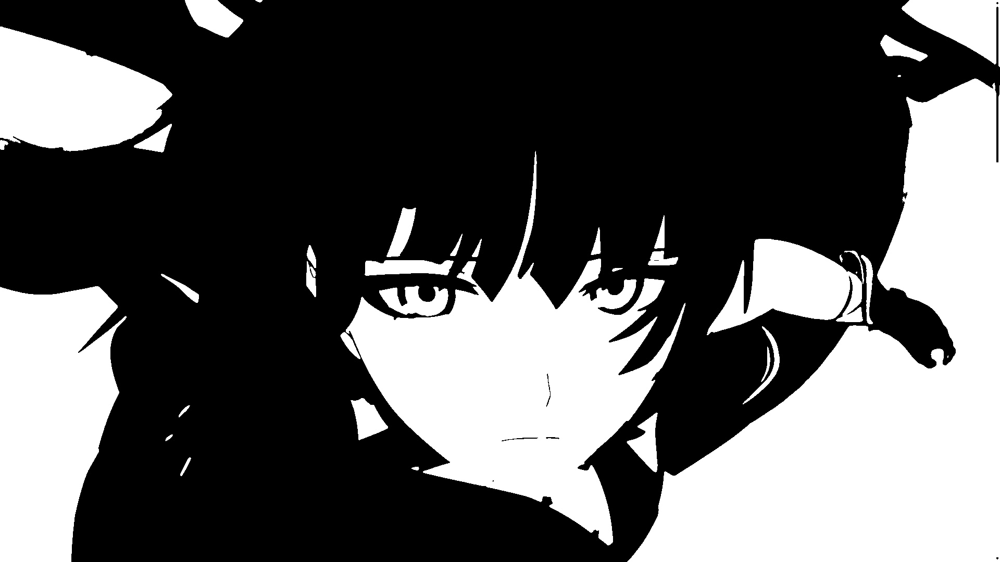

# ImgToASCII
Программа для превращения изображения в ASCII. 

Это проект, вдохновлённый видео [I Tried Turning Games Into Text](https://www.youtube.com/watch?v=gg40RWiaHRY).

## Цель
Изучить алгоритмы для обработки графики.

## Как работает
К изображению применяется ряд фильтров а затем результат выводится в .html файл с возможностью сохранить цвета. Фильтры нужны чтобы сохранить границы объектов и вывести их символами `_ / \ |` в ASCII.

Так как целью является изучение алгоритмов, то упор сделан не на производительность, поэтому изображение обрабатывается на CPU.

## Фильтры
### Оригинал

### Изображение в ASCII

### Изображение в ASCII в цвете

### Размытие по гауссу

### Разность размытий

### Оператор собеля
Цветом показан угол границы

### Оператор собеля + разность размытий
Цветом показан угол границы

## Как скомпилировать 
1. Установите [Go](https://go.dev)
2. Скопируйте исходный код
3. Скомпилируйте командой `go build . -o <имя_файла>`

## Как пользоваться
`./<скомпилированный_файл> <файл_с_изображением> true/false`

true/false - получить ASCII в цвете или нет 